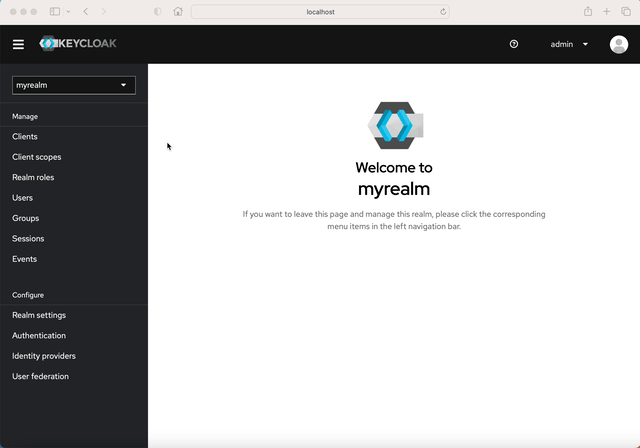

# Docker v2 - Groups and Role Mapper for Keycloak 26.x


## 🧑‍💻 About

This repository provides a MappingProvider for Keycloak's Docker-v2 protocol. It manages registry access for users with client role ```admin``` or ```editor``` and who are assigned to realm groups named like ```registry-${namespace}```. Clients without any roles are treated as ```user``` and will be granted read-only access to the namespace by default. This behavior can be overwritten by environment variables (see configuration) 

## 🛠️ Build
1. Create jar resource using ```./gradlew clean build```
2. Copy  ```/build/libs/*.jar``` into Keycloak´s ```/opt/keycloak/providers/``` folder
3. Build keycloak instance using ```/opt/keycloak/bin/kc.sh build```

See also Keycloak [Dockerfile](https://github.com/alexanderwolz/keycloak-docker-group-role-mapper/blob/main/examples/keycloak-with-mapper/Dockerfile) for reference in [examples](https://github.com/alexanderwolz/keycloak-docker-group-role-mapper/tree/main/examples) section.

## 🔬 Basic Concept
- Users can be grouped to the same repository namespace by assigning them to one or several groups starting with ```registry-```.
- Without any client roles assigned, users will be granted read-only access to their namespaces.
- Default namespaces (repositories without prefix/) can only be accessed by admins.
- Assigning the client role ```editor``` will allow users to also push and delete images in their namespaces.
- Assigning the client role ```admin``` will allow access to any resource in the whole registry and give full access.
- Users could be grouped to domain-namespaces according to their email-addresses  (can be configured via environment variables, default off)
- Without having any roles and groups assigned, users will have full access to the namespace if it matches their username (can be configured via environment variables, default off)

## ⚙️ Configuration
This mapper supports following environment variables (either set on server or in docker container):

| Variable Name                   | Values                                               | Description                                                                                                                                                                                                                                                                                                                                                                                                                                                                                                                                                                                                                                                                                                                                                                                                                              |
|---------------------------------|------------------------------------------------------|------------------------------------------------------------------------------------------------------------------------------------------------------------------------------------------------------------------------------------------------------------------------------------------------------------------------------------------------------------------------------------------------------------------------------------------------------------------------------------------------------------------------------------------------------------------------------------------------------------------------------------------------------------------------------------------------------------------------------------------------------------------------------------------------------------------------------------------|
| ```REGISTRY_CATALOG_AUDIENCE``` | ```editor```, ```user```                             | Will allow editors or users to access *registry:catalog:** scope. That would be of interest to users who want to access UI frontends.<br> No scope is set by default, so only admins are allowed to access registry scope.                                                                                                                                                                                                                                                                                                                                                                                                                                                                                                                                                                                                               |
| ```REGISTRY_NAMESPACE_SCOPE```  | ```group```, ```domain```, ```sld```, ```username``` | If ```group``` is set, users are checked for group membership and will be granted access to the repository according to their roles.<br>If ```domain``` is set, users are checked against their email domain and will be granted access to the repository (e.g. *company.com/image*) according to their roles.<br>If ```sld``` is set, users are checked against their email second level domain (sld) and will be granted access to the repository (e.g. *company/image*) according to their roles.<br>If ```username``` is set, users will be granted full access to the namespace if it matches their username (lowercase check).<br><br>Namespace scope ```group``` is set by default or if value is empty or no value matches ```group```, ```domain```, ```sld``` or ```username``` (all values can be concatenated with ```,```). |
| ```REGISTRY_GROUP_PREFIX```     | any String                                           | Custom group prefix. Will default to ```registry-```. Comparisons will be checked with lowercase String representation.                                                                                                                                                                                                                                                                                                                                                                                                                                                                                                                                                                                                                                                                                                                  |


## 🔒 Keycloak Setup

Keycloak must be setup to have a docker-v2 registry client, roles and optional groups. The registry then must be configured to use OIDC configuration provided by Keycloak

### Enable Docker v2 Protocol Feature
1. In order to use the Docker v2 protocol, the feature ```docker``` must be enabled during Keycloak server startup.
2. This can be done by setting the environment variable ```KC_FEATURES=docker,token-exchange```.

### Create Registry Client Configuration
1. Go to realm and choose "Clients" section
2. Create new client by clicking "Create client"
3. Choose Client Type *docker-v2* and insert client id e.g. "myregistry"
4. Set valid redirect URL

### Create Client Roles
1. In Client Page, choose "Roles"-tab
2. Click "Create role" and set role name to ```admin```
3. Go back to "Roles"-tab
4. Click "Create role" and set role name to ```editor```

### Set the Mapper
1. in Client Page, choose "Client scopes"-tab
2. Go to "myregistry-dedicated" scope
3. Delete "docker-v2-allow-all-mapper" configuration
4. Click "Configure a new mapper" button
5. Choose "Allow by Groups and Roles" mapper (this mapper)
6. Give it a name e.g. "Allow by Groups and Roles Mapper"



### Create Roles
1. Go to realm and choose "Groups" section
2. Click "Create group"
3. Name it "registry-mycompany"

### Assign Roles to users
1. Go to realm and choose "Users" section
2. Choose your user and select "Role mapping"
3. Click "Assign role"
4. Filter by "clients" and search for 'myregistry'
5. Choose either ```admin``` or ```editor```
6. Click "Assign"

### Assign Groups to users
1. Go to realm and choose "Users" section
2. Choose your user and select "Groups"
3. Click "Join Group"
4. Select "registry-mycompany"
5. Click "Join"
6. Now the user will have access to registry namespace *myregistry.com/mycompany/*


- - -

Made with ❤️ in Bavaria
<br>
© 2025, <a href="https://www.alexanderwolz.de"> Alexander Wolz
